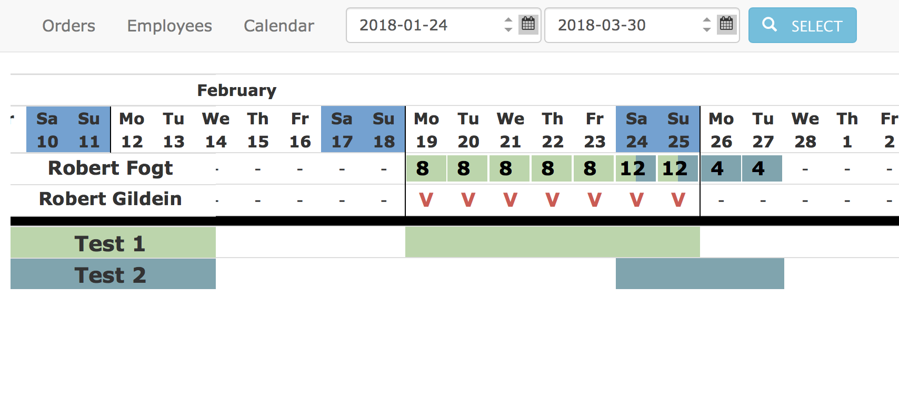

# Resources Manager

It's basic **django** app used for tracking all employees' work in one calendar. This is used only by employers or project managers to monitor the availability of workers.

[Live Demo](http://app.r-f.group/resources)

There are three subpages containing:

##### Orders

* `name` represents the name of order
* `short` represents the shortcut of order (In the live demo is just used as a filter in the table)
* `status` only active orders can be selected in the calendar
* `colort` color of the order in the calendar
* `info` some info or notes

##### Employees

* `name` represents the name of employee
* `team` in the calendar each employee will be ranked according to the team
* `color` color of the employee in the calendar
* `info` some info or notes

##### Calendar

The default calendar range is 60 days (14 backwards and 46 forward). The calendar is divided into two parts, the first is the calendar of employees and the second shows the time intervals of individual orders. To assign a new order, unavailability, vacation or holiday to an employee, you must click on the name or highlight the period.